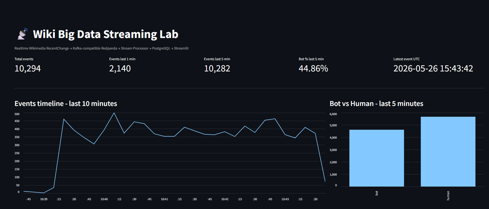
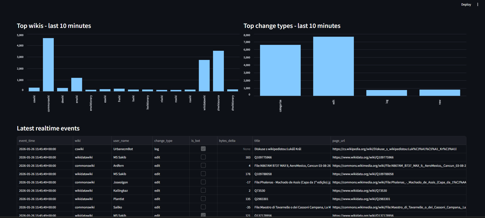

# Real-time Wikimedia Streaming Data Platform

A production-style **Data Engineering streaming project** that ingests live Wikimedia edit events, streams them through a Kafka-compatible message broker, processes the events in near real time, stores curated records in PostgreSQL, and serves operational analytics through a Streamlit dashboard.

This project is designed as a portfolio-ready Data Engineer project: it demonstrates event-driven ingestion, message queue design, stream processing, idempotent database loading, containerized deployment, observability, and real-time analytics.

---

## 1. Project Summary

Public Wikimedia projects generate a continuous stream of edit events. This project captures those events from the Wikimedia RecentChange stream and builds a local end-to-end streaming pipeline to answer operational questions such as:

- How many edit events are happening per minute?
- Which Wikimedia domains are most active right now?
- What is the ratio between bot activity and human activity?
- Which pages were edited most recently?
- How much content volume changed based on byte delta?
- Is the streaming pipeline continuously receiving, processing, and loading new data?

The final result is a real-time dashboard where new events are visible continuously without manually refreshing the database or rerunning batch scripts.

---

## 2. Architecture

Architecture diagram:

```text
diagrams/architecture.svg
diagrams/architecture.png
```

High-level flow:

```text
Wikimedia EventStreams
        │
        ▼
Python Producer
        │
        ▼
Redpanda / Kafka-compatible Broker
        │
        ▼
Python Stream Processor
        │
        ▼
PostgreSQL Serving Database
        │
        ▼
Streamlit Real-time Dashboard
```

The project uses **Redpanda** as a Kafka-compatible broker to keep the local environment lightweight while still practicing Kafka concepts such as topics, partitions, consumer groups, offsets, producer/consumer separation, and at-least-once delivery.

---

## 3. Tech Stack

| Layer | Technology | Purpose |
|---|---|---|
| Data Source | Wikimedia EventStreams | Live RecentChange events from public Wikimedia projects |
| Ingestion | Python, requests | Consume Server-Sent Events and publish JSON messages |
| Message Broker | Redpanda | Kafka-compatible streaming broker |
| Stream Processing | Python, confluent-kafka | Consume events, transform schema, batch-write to database |
| Storage / Serving | PostgreSQL | Store curated analytical records |
| Dashboard | Streamlit | Visualize real-time metrics and latest events |
| Deployment | Docker Compose | Run the full stack locally with reproducible services |
| Testing | unittest | Validate transformation logic |

---

## 4. Data Engineering Capabilities Demonstrated

This project demonstrates practical Data Engineering skills that are useful in real production systems:

- Building an event-driven data ingestion service from a live streaming API.
- Designing a Kafka-style architecture with producer, broker, topic, partitions, consumer group, and offset management.
- Implementing stream processing logic with schema normalization and data quality handling.
- Writing records to PostgreSQL using batch inserts and idempotent loading.
- Preventing duplicate records with a primary key and `ON CONFLICT DO NOTHING`.
- Separating raw event ingestion from curated analytical storage.
- Creating a serving layer for BI/dashboard use cases.
- Containerizing all services with Docker Compose.
- Adding basic unit tests for transformation functions.
- Providing debugging commands for logs, broker topics, and database validation.

---

## 5. Folder Structure

```text
wiki_bigdata_streaming_lab/
├── README.md
├── docker-compose.yml
├── requirements.txt
├── .env.example
├── common/
│   ├── __init__.py
│   ├── config.py
│   └── transform.py
├── services/
│   ├── producer/
│   │   ├── __init__.py
│   │   └── wiki_producer.py
│   ├── processor/
│   │   ├── __init__.py
│   │   └── stream_processor.py
│   └── dashboard/
│       ├── __init__.py
│       └── app.py
├── sql/
│   └── init.sql
├── docker/
│   └── Dockerfile
├── diagrams/
│   ├── architecture.svg
│   └── architecture.png
├── docs/
│   ├── images/
│   │   ├── dashboard_overview.png
│   │   └── dashboard_realtime_events.png
│   ├── 01_learning_path.md
│   ├── 02_streaming_concepts.md
│   ├── 03_processing_method.md
│   └── 04_flink_next_step.md
├── scripts/
│   ├── check_postgres.sql
│   └── reset_local.md
└── tests/
    └── test_transform.py
```

---

## 6. Data Flow Details

### 6.1 Source: Wikimedia EventStreams

The producer connects to the Wikimedia RecentChange stream and continuously receives live change events. Each event is parsed as JSON and published to the broker.

Main file:

```text
services/producer/wiki_producer.py
```

Responsibilities:

- Connect to the Wikimedia Server-Sent Events endpoint.
- Parse incoming event payloads.
- Validate JSON structure.
- Publish raw messages to the Kafka-compatible topic.
- Reconnect automatically when temporary network errors occur.

### 6.2 Broker: Redpanda

Redpanda acts as the message buffer between ingestion and processing.

Topic:

```text
wiki.recentchange.raw
```

Configuration:

```text
partitions: 6
replication factor: 1
```

Responsibilities:

- Store incoming raw events.
- Decouple producer and processor workloads.
- Allow consumer-group based processing.
- Track offsets for reliable consumption.

### 6.3 Stream Processor

The processor consumes raw events, normalizes nested JSON into a relational schema, and writes curated records to PostgreSQL.

Main file:

```text
services/processor/stream_processor.py
```

Transformation logic:

```text
common/transform.py
```

Responsibilities:

- Consume events from `wiki.recentchange.raw`.
- Extract business fields such as wiki, domain, user, title, change type, bot flag, timestamp, and byte delta.
- Convert timestamps into PostgreSQL-compatible values.
- Batch insert records into PostgreSQL.
- Use idempotent inserts to avoid duplicates.
- Commit Kafka offsets only after successful database writes.

Processing pattern:

```text
At-least-once processing + idempotent sink
```

This means the same event may be processed again after a failure, but duplicate rows are prevented by the `event_id` primary key.

### 6.4 PostgreSQL Serving Layer

PostgreSQL stores curated records for dashboard and SQL analysis.

Main table:

```text
fact_recent_changes
```

Key fields:

| Column | Meaning |
|---|---|
| event_id | Unique event identifier |
| event_time | Time when the Wikimedia event happened |
| ingest_time | Time when the event was loaded into PostgreSQL |
| wiki | Wikimedia wiki code |
| domain | Wikimedia domain |
| user_name | User or bot that made the change |
| title | Edited page title |
| change_type | Type of recent change event |
| is_bot | Whether the editor is a bot |
| is_minor | Whether the edit is marked as minor |
| bytes_delta | Content size difference between old and new revision |
| raw_event | Original JSON payload stored as JSONB |

Database initialization file:

```text
sql/init.sql
```

### 6.5 Dashboard

The dashboard reads from PostgreSQL and refreshes automatically to show new data in near real time.

Main file:

```text
services/dashboard/app.py
```

Dashboard features:

- Total event count.
- Latest event timestamp.
- Events per minute.
- Top active wikis/domains.
- Bot vs human activity.
- Latest edited pages.
- Recent byte delta trends.

---

## 7. Demo Results

After the Docker Compose stack is started, the Streamlit dashboard updates automatically and displays near real-time metrics from the PostgreSQL serving layer. The screenshots below show the system running successfully with live Wikimedia RecentChange events being ingested, processed, stored, and visualized continuously.

### 7.1 Real-time Monitoring Overview



This view validates the main streaming pipeline output:

- **Total events** confirms that records are continuously accumulated in PostgreSQL.
- **Events last 1 minute / 5 minutes** shows near real-time ingestion throughput.
- **Bot percentage** provides a quick split between bot-generated and human-generated activity.
- **Latest event timestamp** confirms that fresh data is still being processed.
- **Event timeline** shows minute-level event volume.
- **Bot vs Human** compares automated and human edit activity over the latest processing window.

### 7.2 Wiki Activity, Change Types, and Latest Events



This view provides operational analytics on top of the streaming data:

- **Top wikis** identifies which Wikimedia projects are most active in the latest time window.
- **Top change types** shows the distribution of edit, log, categorize, and new-page events.
- **Latest realtime events** exposes the most recent curated records loaded into PostgreSQL, including event time, wiki, user, change type, bot flag, byte delta, page title, and page URL.

These results demonstrate that the system is not a static batch demo. It continuously consumes a live streaming source, processes new events, writes them into a relational serving layer, and refreshes the dashboard automatically.

---

## 8. Prerequisites

Install the following tools:

- Docker Desktop
- Visual Studio Code
- Recommended VS Code extensions:
  - Docker
  - Python
  - PostgreSQL or SQLTools

Python does not need to be installed locally if the project is run fully through Docker.

---

## 9. How to Run

### Step 1: Open the project

```powershell
cd path\to\wiki_bigdata_streaming_lab
code .
```

### Step 2: Start all services

```powershell
docker compose up --build -d
```

The first run may take a few minutes because Docker needs to download images and install Python dependencies.

### Step 3: Check service status

```powershell
docker compose ps
```

Expected services:

```text
redpanda
redpanda-init
postgres
producer
processor
dashboard
```

### Step 4: Watch streaming logs

```powershell
docker compose logs -f producer processor
```

You should see the producer receiving Wikimedia events and the processor writing records to PostgreSQL.

### Step 5: Open the dashboard

```text
http://localhost:8501
```

The dashboard refreshes automatically every few seconds.

---

## 10. Ports and Credentials

| Component | Host Address | Internal Docker Address |
|---|---|---|
| Streamlit Dashboard | `http://localhost:8501` | `dashboard:8501` |
| Redpanda Kafka API | `localhost:19092` | `redpanda:9092` |
| Redpanda Admin API | `http://localhost:9644` | `redpanda:9644` |
| PostgreSQL | `localhost:5432` | `postgres:5432` |

PostgreSQL credentials:

```text
database: streaming
username: stream
password: stream
```

---

## 11. Validation Commands

Check whether records are being inserted:

```powershell
docker exec -it wiki_stream_postgres psql -U stream -d streaming -c "select count(*) as total_events, max(event_time) as latest_event_time from fact_recent_changes;"
```

View the latest events:

```powershell
docker exec -it wiki_stream_postgres psql -U stream -d streaming -c "select event_time, wiki, user_name, title, change_type, bytes_delta from fact_recent_changes order by event_time desc limit 10;"
```

View event volume by minute:

```powershell
docker exec -it wiki_stream_postgres psql -U stream -d streaming -c "select date_trunc('minute', event_time) as minute, count(*) as events from fact_recent_changes group by 1 order by 1 desc limit 10;"
```

List Redpanda topics:

```powershell
docker exec -it wiki_stream_redpanda rpk topic list -X brokers=localhost:9092
```

Describe the raw topic:

```powershell
docker exec -it wiki_stream_redpanda rpk topic describe wiki.recentchange.raw -X brokers=localhost:9092
```

---

## 12. Testing

Run unit tests for transformation logic:

```powershell
docker compose run --rm processor python -m unittest discover -s tests
```

The tests validate that raw Wikimedia events can be normalized into the expected analytical schema.

---

## 13. How to Stop or Reset

Stop containers but keep PostgreSQL data:

```powershell
docker compose down
```

Stop containers and remove volumes/data:

```powershell
docker compose down -v
```

Rebuild everything from scratch:

```powershell
docker compose down -v
docker compose build --no-cache
docker compose up -d
```

---

## 14. Troubleshooting

### Dashboard shows `ModuleNotFoundError: No module named 'common'`

This project sets `PYTHONPATH=/app` in the Docker image. If the error appears after editing the Dockerfile, rebuild the image:

```powershell
docker compose down
docker compose build --no-cache
docker compose up -d
```

### Dashboard opens but no data appears

Check producer and processor logs:

```powershell
docker compose logs -f producer processor
```

Common causes:

- The machine cannot access the Wikimedia streaming endpoint.
- The broker is still starting.
- The processor is waiting for topic creation.

### PostgreSQL port 5432 is already used

Change the host port in `docker-compose.yml`:

```yaml
ports:
  - "5433:5432"
```

Internal Docker services should still use `postgres:5432`.

### Containers keep restarting

Inspect logs:

```powershell
docker compose logs -f
```

Then rebuild after fixing the error:

```powershell
docker compose build --no-cache
```

---

## 15. Production Improvements

This local lab can be extended into a more production-grade streaming platform with:

- Schema Registry for message schema governance.
- Dead-letter queue for invalid or unprocessable events.
- Apache Flink or Spark Structured Streaming for stateful processing.
- Data lake storage such as S3/MinIO for raw event retention.
- Analytical storage such as ClickHouse, Apache Druid, Apache Pinot, or BigQuery.
- Monitoring with Prometheus and Grafana.
- CI/CD pipeline for automated testing and deployment.
- Secrets management instead of plain environment variables.
- Data quality checks and alerting.

---
